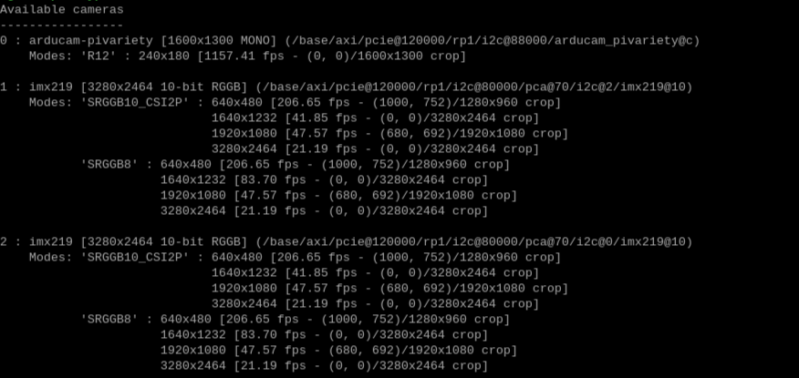

# Guide d'utilisation de la caméra de profondeur.

Dans cette partie, vous verrez comment réaliser une carte de profondeur, à la fois sur la partie Software, Hardware, ainsi que la réalisation d'une boîte où mettre tous les composants.


## Prérequis

Afin de réaliser ce projet, vous aurez besoin des composants suivants : (mettre les liens où ce les fournir)
- Raspberry Pi 5
- capteur Temps-de-vol (ToF)
- système binoculaire composé de 2 caméras de type IMX219
- module V2.2 (multiplexeur caméras)
- câble d'alimentation 5V, 5A
- clavier et souris
- écran avec câble microHDMI (choississez le type de câble en fonction de votre écran)

Pour réaliser la boîte, vous aurrez besoin d'une imprimante 3D ainsi que de fil PLA pour l'impression.

Vous aurez aussi besoin d'un fer à souder, d'étain et de câbles. 

## Guide d'installation

Afin de pouvoir réaliser une caméra de profondeur, assurez-vous d'avoir d'abord tous les éléments indiqués dans la partie précédente.

Le paramétrage de chaque composant est donné dans le dossier respectif du composant.

Suivez l'installation suivant cette ordre :

1. Paramétrage de la Raspberry Pi
2. Paramétrage du ToF
3. Paramétrage du système binoculaire

Assurer d'avoir les mêmes lignes de la configuration que celui de l'exemple fournit.

Une fois ces étapes finies, vous pouvez alos monter la boite et installer votre système.


## Guide de montage de la boite

Dans cette partie, nous allons voir commenter monter la boîte (image finale de la boite)
Vous trouverez les différentes pièces à imprimer dans le dossier 3D print.
Attention, les supports ne sont pas inclus. Il faudra que vous les ajoutiers lors de l'impression.

Il est conseillé d'avoir d'abord suivi les instructions précédentes et s'être assuré que tous les systèmes fonctionnent avant de monter la boîte. Il est possible qu'un composant soit défectueux.

1. Brancher les câbles CSI sur la Raspberry Pi
2. Placer la Raspberry Pi à sa place. Pour la rentrer, metter un léger angle à cause des embouts USB. Il faudra un peu forcé. Les USB doivent dépasser. Vous pouvez alors vérifier les ports HDMI et USB-C
3. Brancher les câbles CSI sur le module V2.2.
4. Le module V2.2 est fournit avec 2 entretoise. Mettre les entretoises dans les troues de la Raspberry Pi
5. Mettre le module sur la Raspberry Pi et fixer avec les vis sur les entretoises.
6. Metter les caméras dans l'emplacement dédié et les fixer avec des vis et des boulons
7. Sur la face avant : fixer le ToF avec des vis et des boulons.
8. Connecter toutes les caméras et le ToF à la Raspberry Pi.
9. Fixer la face avant de la boîte : d'abord les trous du bas, puis ceux du haut.
10. Brancher le cable microHDMI et l'alimentation
11. Fermer le couverle et brancher clavier et sourris
12. Allumer la Raspberry Pi et vérifier la connection des caméras en ouvrant un terminal
```bash
libcamera-still --list
```
Voici ce que vous devez obtenir :



En cas de problème, recommencer les étapes. Il est possible qu'un câble se soit déconnecté, ou qu'il soit branché dans le mauvais sens.

## Utilisation de la depth camera
Après compilation du code, vous pouvez intéragir avec le code.

Appuyer sur les touches du clavier après avoir cliqué sur la fenêtre avec lequel vous voulez interagir:
- `q` pour quitter
- `s` pour sauvegarder des images de la carte de profondeur
- `t` pour analyser les objets visibles, et connaître leur distance

Pour stopper complètement le code, appuyer sur `CTRL+C`. Vous devrez cependant redémarrer la Raspberry Pi si vous voulez relancer le code.

## Compilation

Pour compiler le code, utilser la ligne :

```bash
python main.py
```

## Code
### Classe `DepthMapProcessor`
Cette classe gère le traitement des cartes de profondeur et de disparité, y compris la segmentation, le calcul des amplitudes moyennes, et le dessin des contours.

#### `__init__`
Initialise la classe `DepthMapProcessor` avec les paramètres fournis.

#### `apply_morphological_operations`
Applique des opérations morphologiques (dilatation et érosion) à l'image spécifiée.

#### `calculate_mean_amplitude`
Calcule l'amplitude moyenne pour chaque contour spécifié.

#### `find_and_draw_contours`
Trouve et dessine les contours dans l'image traitée.

#### `process_contour`
Traite les contours en appliquant des opérations morphologiques, en trouvant et en dessinant les contours, et en calculant les amplitudes moyennes pour les contours trouvés.

#### `process_disparity_image`
Traite l'image de disparité en la segmentant selon les seuils définis, puis en appliquant le traitement de contours sur chaque segment.

### Classe `DualCameraCapture`
Cette classe gère la capture d'images avec deux caméras, y compris la validation et l'affichage des images capturées.

#### `__init__`
Initialise les paramètres pour la capture d'images avec deux caméras.

#### `capture_and_save_image`
Capture et sauvegarde une image depuis la caméra spécifiée.

#### `display_images`
Affiche les images capturées à partir des fichiers spécifiés.

#### `validate_images`
Valide si les images capturées sont acceptables.

#### `capture_images`
Capture un nombre spécifié de paires d'images et les sauvegarde dans le dossier spécifié.

### Classe `StereoVision`
Cette classe gère la vision stéréo, y compris la capture d'images, le calcul des cartes de disparité et de profondeur, et le traitement des cartes de profondeur.

#### `__init__`
Initialise les paramètres pour la vision stéréo.

#### `stereo_taking`
Capture et rectifie les images stéréo.

#### `save_images`
Sauvegarde les images et la carte de disparité normalisée.

#### `depth_map_calcul`
Calcule la carte de disparité à partir des images rectifiées.

#### `depth_calcul`
Calcule la profondeur pour chaque pixel à partir de la carte de disparité.

#### `process_stereo`
Traite la carte de profondeur en utilisant `DepthMapProcessor`.

#### `capture_and_compute`
Capture les images, calcule la carte de disparité et la profondeur, puis place les résultats dans une file d'attente.

#### `depth_map_display`
Affiche la carte de disparité et la profondeur à partir des résultats de la file d'attente.

#### `process_and_display`
Crée des processus pour la capture et le calcul des images, ainsi que pour l'affichage des résultats.

### Fonctions

#### `folder_create`

Vérifie si un dossier existe, sinon il le crée.

#### `file_create`

Crée un fichier du type spécifié dans un dossier donné (facultatif).

#### `show_image`

Affiche une image avec une colormap spécifiée.

#### `calibrate_cameras`

Calibre les caméras en utilisant un processus de calibration basé sur des photos d'un échiquier.

#### `run_tof_camera`

Exécute la caméra ToF en continu et met à jour une queue avec les données de profondeur.

#### `run_stereo_vision`

Exécute la vision stéréo pour obtenir les résultats de la disparité et de la profondeur.

#### `terminate_processes`

Termine les processus donnés.

#### `kill_zombie_processes`

Termine les processus zombies détectés sur le système.

#### `clean_temp_dirs`

Nettoie les répertoires temporaires spécifiés.

#### `cleanup`

Effectue les opérations de nettoyage du système et libère la mémoire.


