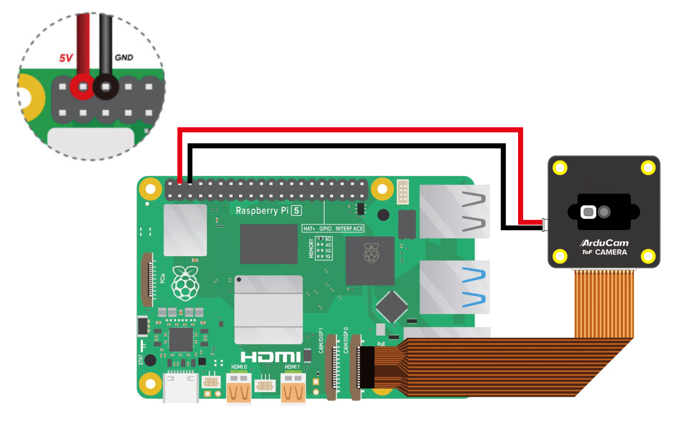
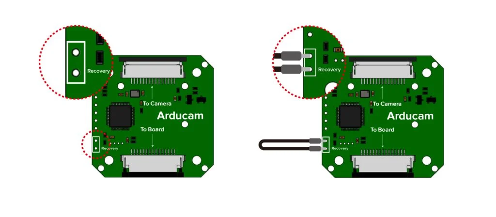
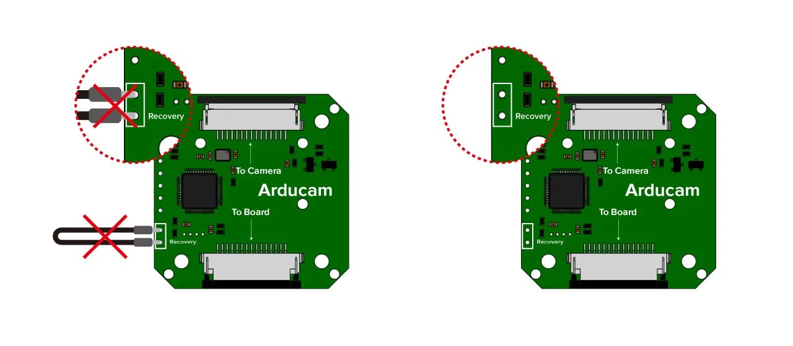
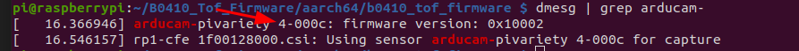
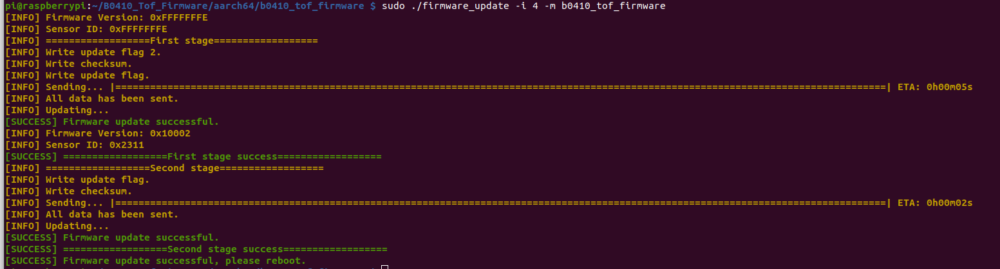

# Configuration du Capteur de Temps de Vol (ToF)

Ce document fournit des instructions pour configurer un capteur de temps de vol (ToF) sur votre Raspberry Pi 5. Dans un premier temps, nous allons voir comment initialiser le capteur sur la Raspberry Pi. Une fois ces étapes faites, vous n'aurez pas besoin de les refaies. Vous pourrez alors juste compiler les codes.

## Matériel Requis

Avant de commencer, assurez-vous d'avoir les éléments suivants :

- Raspberry Pi compatible
- Capteur de Temps de Vol (ToF)
- Câble GPIO (le cas échéant)
- Câble Mâle - Mâle qui servira de ligne Dupont

## Étapes de Configuration

### Connection sur la Raspberry Pi 5

Connecter sur l'entrée cam 0 (le plus proche du connecteur Internet) le câble csi, et le 5 V et GND sur les pins, comme indiqué sur le schéma suivant :



### Étape 1. Connectez la caméra Arducam ToF à Raspberry Pi
Attention, la Raspberry Pi doit rester éteinte pendant la connection, et le câble d'alimentation retiré.

### Étape 2. Maintenez votre Raspberry Pi hors tension

Veuillez maintenir votre Raspberry Pi hors tension et activer la récupération sur la carte de la caméra Arudcam ToF en utilisant la ligne Dupont (un câble mâle-mâle peut suffir dans le cas où vous n'avez pas la ligne Dupont)  :



### Étape 3. Allumez votre Raspberry Pi

Veuillez désactiver la récupération après avoir allumé le RPi :



Il suffit de retirer la ligne Dupont 

## Télécharger l'Outil de Mise à Jour du Firmware

```bash
B0410_Tof_firmware.tar.gz
```

## Installer les Dépendances

```bash
sudo apt update -y && sudo apt install -y libtinfo5
```

## Dézipper l'Outil de Mise à Jour

### Astuce

Vous pouvez vérifier s'il s'agit d'un système 32 bits ou 64 bits en utilisant la commande `dpkg --print-architecture`. Ensuite, vous pouvez exécuter les commandes suivantes en fonction de la version du système d'exploitation :

```bash
tar xzvf B0410_Tof_Firmware.tar.gz
# pour un système 64 bits
cd B0410_Tof_Firmware/aarch64/

# pour un système 32 bits
cd B0410_Tof_Firmware/armv7l/
```

## Mettre à Jour le Firmware

### Vérifier le bus i2c :

Vous pouvez alors vérifier la liaison I2C :

```bash
dmesg | grep arducam
```
Vous devez voir le code x-000c.

Par défaut, le code est 4-000c. Mais il est possible que ce code change. 




### Mettre à jour le bus i2C :

Il faut ensuite mettre à jour le firmware. Pour cela entrer la ligne suivante dans votre terminal :
Pensez à modifier le x par le numéro de port de la liaison I2C.

```bash
sudo ./firmware_update -i x -m b0410_tof_firmware
```

Vérifier que l'adresse est 0xFFFFFFFE sur les premières lignes.


Sinon, refaites les étapes pour connecter le capteur. Vous devrez alors refaire les 2 dernières étapes.

### Reboot
Ensuite, redémarrer votre système.

``` bash
sudo reboot
```

## Utilisation de la caméra

Pour utiliser la caméra, suivez les étapes suivantes :

### Step 1. Télécharger le git

``` bash
git clone https://github.com/ArduCAM/Arducam_tof_camera.git
```
### Step 2. Entrer dans le dossier

``` bash
cd Arducam_tof_camera
```
### Step 3. Installer les dépendances.

``` bash
./Install_dependencies.sh
```
Entrer y pour redémarrer la Raspberry Pi.

Vous pouvez vérifier que la ligne suivante est bien apparu dans votre fichier config.txt

``` bash
dtoverlay = arducam-pivariety,cam0
```


### Step 4. Compiler
Compiler alors pour vérifier le fonctionnement, et installer tous les éléments manquants.
``` bash
./compile.sh
```
Le live caméra devrait alors s'ouvrir. Utiliser Ctrl + C pour arrêter le code.

### Step 5. Configuration python
Entrer cette ligne dans le terminal
``` bash
./Install_dependencies_python.sh
```

IL est possible que de temps en temps, vous aillez besoin de refaire les étapes 3 et 4. En effet, certaines librairies peuvent avoir besoin d'être mise-à-jour, ou que la connection avec le Tof soit perdu. Vous n'avez pas besoinde refaire l'étape 5.

# Le code
L'objectif de ce code est de faire fonctionne le ToF à travers un processus. Afin de le faire fonctionner, veuillez-vous référencer au main.py.

Dans la suite de ce guide, nous verrons le fichier source tof_sensor.py.

## Description du code

### Description
La classe `TofCamera` gère la capture d'images à partir d'une caméra ToF (Time-of-Flight), le traitement des données de profondeur et d'amplitude, ainsi que l'affichage des résultats.

### Méthodes

#### `__init__(self, max_distance: float)`
Initialise la caméra ToF avec la distance maximale mesurable.

#### `process_frame(self) -> np.ndarray`
Traite le cadre capturé et retourne l'image résultante.

#### `capture_image(self)`
Sauvegarde l'image résultante sous le nom `tof{n}.png`.

#### `process_tof(self)`
Traite la carte de profondeur pour extraire les contours.

#### `continuous_display(self)`
Capture et affiche les images en continu à partir de la caméra ToF.

#### `cleanup(self)`
Arrête et ferme la caméra, et détruit toutes les fenêtres OpenCV.

#### `get_depth_buf(self) -> np.ndarray`
Retourne le tampon de profondeur actuel.

#### `get_depth_normalized(self) -> np.ndarray`
Retourne la carte de profondeur normalisée.


