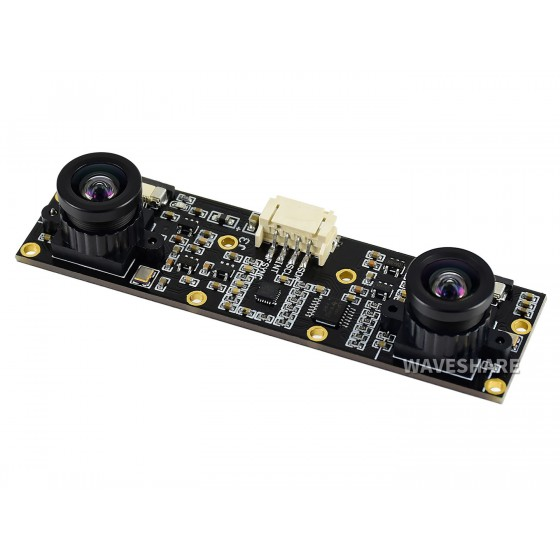
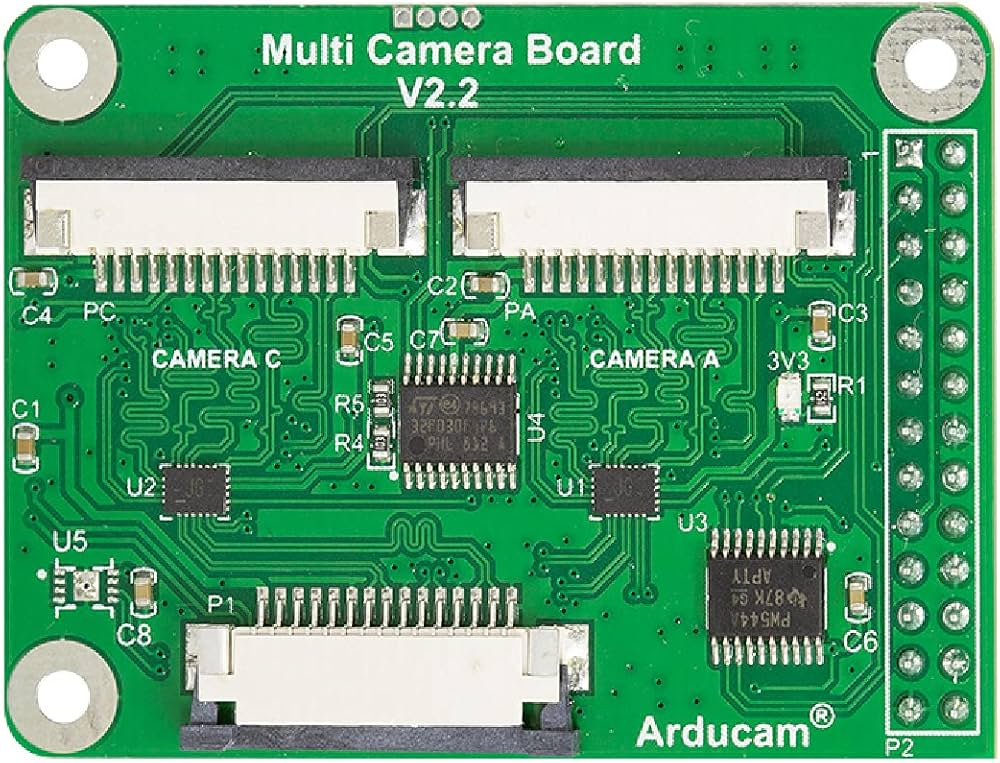

# Configuration des caméras

Dans cette partie, nous allons voir comment configurer les 2 caméras IMX219 (ou autres caméras) sur un multiplexeur de caméras d'Arducam (module V2.2). 

<div style="display: flex; justify-content: space-between;">
    
    
</div>


Dans un premier temps, assurez-vous d'avoir les câbles caméra adapter pour l'utilisation avec le module V2.2.

Pour arriver à faire fonctionner les caméras sur ce module, les caméras doivent être du même modèle.

Dans un terminal, ouvrez le fichier de configuration :
```bash
sudo nano /boot/firmware/config.txt
```

Dans le fichier de configuration, vous devrez ajouter les lignes suivantes :

```ini
dtoverlay=arducam-pivariety,cam1
dtoverlay=camera-mux-4port,cam0-imx219,cam2-imx219
```
Vous devrez alors associer à chaque port son numéro. Voici la correspondance des lettres :
- cam0 : A
- cam1 : B
- cam2 : C
- cam3 : D


# Calibration des caméras stéréo

Dans cette partie, nous allons voir comment calibrer les caméras afin de pouvoir les utiliser.
Cette calibration va nous permettre de connaître les paramètres intrinsèques et extrinsèques de nos caméras.

Le principe de la vision stéréo est d'avoir une matrice à droite et à gauche pour chaque caméra. Chaque élément de nos caméras sont stockés dans des dictionnaires.

Si vous voulez comprendre le principe de fonctionnement d'un système binoculaire, veuillez vous référer au document mathematics_model.pdf. Il retrace la modéliation mathématique.

Afin de garder en mémoire votre calibration, les données sont automatiquement enregistrés dans le dossier 'data'. Sa réutilisation est automatique aussi. Vous n'aurez pas besoin de modifier le code.

## Processus de la calibration
Afin de calibrer les caméras, vous avez besoin d'un échéquier. Vous pouvez imprimer le fichier fournit. Cependant, vous devez vous assurer qu'il soit rigide, pour empêcher des erreurs de calcul sur la distorsion des caméras.

Lorsque vous indiquez vouloir calibrer les caméras en mettant 'y', vous aurez la possibilité d'indiquer le nombre de lignes et de colonnes sur l'échéquier, ainsi que le nombre d'images que vous voulez prendre.

Prenez différentes positions avec l'échéquier. Il faut cependant faire attention à ce qu'il soit en entier sur les images, et qu'il soit asses proche des caméras afin d'avoir la meilleur qualité de calibration. Vous pouvez valider ou invalider les images prises si elle ne vous conviennent pas.

## Processus de mesure

Les images sont prises de manière automatique, dans delais. Vous pouvez cependant en mettre, en modifiant la classe, au moment de sa déclaration dans stere_vision.py.

Une fenêtre va alors s'ouvrir afin de voir la carte. Vous pouvez modifier les valeurs du filtres de la depth camera en cas de besoin, si le résultat ne vous convient pas.

# Le code

## Description du code
Dans cette partie nous allons voir les différentes classe et fonction qui permettent de calculer la carte de profondeur, de calibrer ainsi que la prise d'image avec les caméras.


## StereoCalibration

### Description
Gère les paramètres et les processus de calibration stéréoscopique pour deux caméras.

### Méthodes

#### `__str__(self)`
Retourne une représentation en chaîne de caractères des attributs de la classe.

#### `__init__(self)`
Initialise les paramètres de calibration pour les caméras stéréo.

#### `save_data(self)`
Enregistre les paramètres de calibration dans des fichiers `.npy` et `.csv`.

#### `rectify(self, frames: list) -> list`
Rectifie les images stéréoscopiques en utilisant les cartes de dédistorsion et de rectification.

#### `load_data(self, directory: str)`
Charge les paramètres de calibration à partir de fichiers `.npy` dans un répertoire spécifié.

## Calibrator

### Description
Gère le processus de calibration pour une paire de caméras stéréoscopiques.

### Méthodes

#### `__init__(self, row: int, column: int, square_size: float, image_size: tuple)`
Initialise les paramètres pour le calibrage des caméras.

#### `corner_detect(self, image_pair: tuple)`
Détecte les coins du tableau de calibration dans une paire d'images.

#### `calibrate_camera(self) -> StereoCalibration`
Calibre les deux caméras et détermine leurs matrices liées.

#### `calibration_process(self, nbr_photo: int, image_folder: str) -> StereoCalibration`
Effectue le processus de calibration en lisant les images de calibration et en appelant la méthode de calibration.

### Classe `DualCameraCapture`

#### `__init__`
Initialise les paramètres pour la capture d'images avec deux caméras.

#### `capture_and_save_image`
Capture et sauvegarde une image depuis la caméra spécifiée.

#### `display_images`
Affiche les images capturées à partir des fichiers spécifiés.

#### `validate_images`
Valide si les images capturées sont acceptables.

#### `capture_images`
Capture un nombre spécifié de paires d'images et les sauvegarde dans le dossier spécifié.

### Classe `StereoVision`

#### `__init__`
Initialise les paramètres pour la vision stéréo.

#### `stereo_taking`
Capture et rectifie les images stéréo.

#### `save_images`
Sauvegarde les images et la carte de disparité normalisée.

#### `depth_map_calcul`
Calcule la carte de disparité à partir des images rectifiées.

#### `depth_calcul`
Calcule la profondeur pour chaque pixel à partir de la carte de disparité.

#### `process_stereo`
Traite la carte de profondeur en utilisant `DepthMapProcessor`.

#### `capture_and_compute`
Capture les images, calcule la carte de disparité et la profondeur, puis place les résultats dans une file d'attente.

#### `depth_map_display`
Affiche la carte de disparité et la profondeur à partir des résultats de la file d'attente.

#### `process_and_display`
Crée des processus pour la capture et le calcul des images, ainsi que pour l'affichage des résultats.
